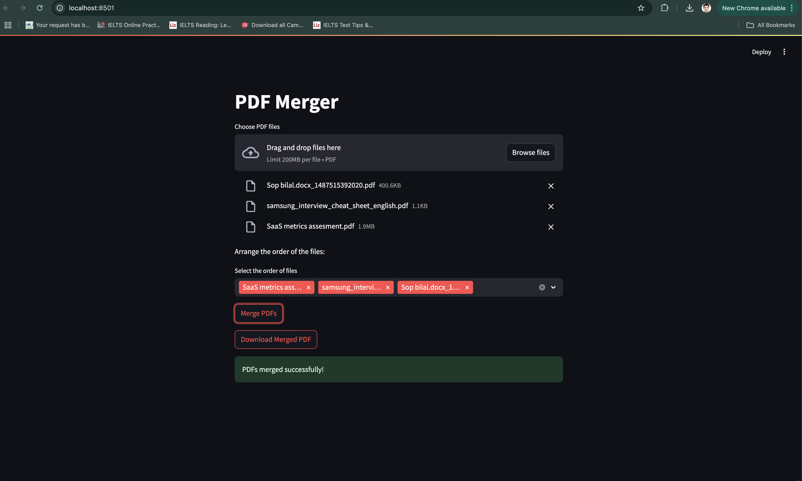

# PDF Merger

A simple web application that allows users to upload multiple PDF files, arrange them in the desired order, and merge them into a single PDF document.

## Features

- Upload multiple PDF files.
- Arrange the order of the uploaded files.
- Merge the selected PDFs into one.
- Download the merged PDF file.

## Technologies Used

- Python
- Streamlit
- PyPDF2

## Installation

1. Clone the repository:

   ```bash
   git clone https://github.com/mbilalnust/pdf_combiner.git
   cd pdf_combiner
   ```

2. Create a virtual environment (optional but recommended):

   ```bash
   python -m venv venv
   source venv/bin/activate  # On macOS/Linux
   venv\Scripts\activate     # On Windows
   ```

3. Install the required packages:

   ```bash
   pip install -r requirements.txt
   ```

## Usage

1. Run the application:

   ```bash
   streamlit run app.py
   ```

2. Open your web browser and go to `http://localhost:8501`.

3. Upload your PDF files, arrange them as desired, and click the "Merge PDFs" button.

4. Download the merged PDF file.

## Screenshots



## Contributing

Contributions are welcome! Please feel free to submit a pull request or open an issue.

## License

This project is licensed under the MIT License. See the [LICENSE](LICENSE) file for details.